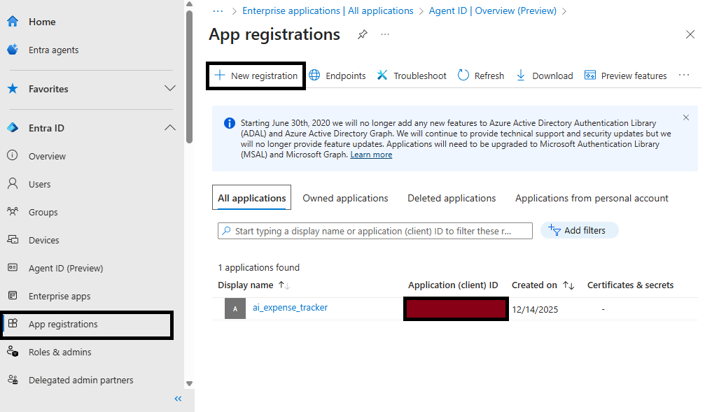
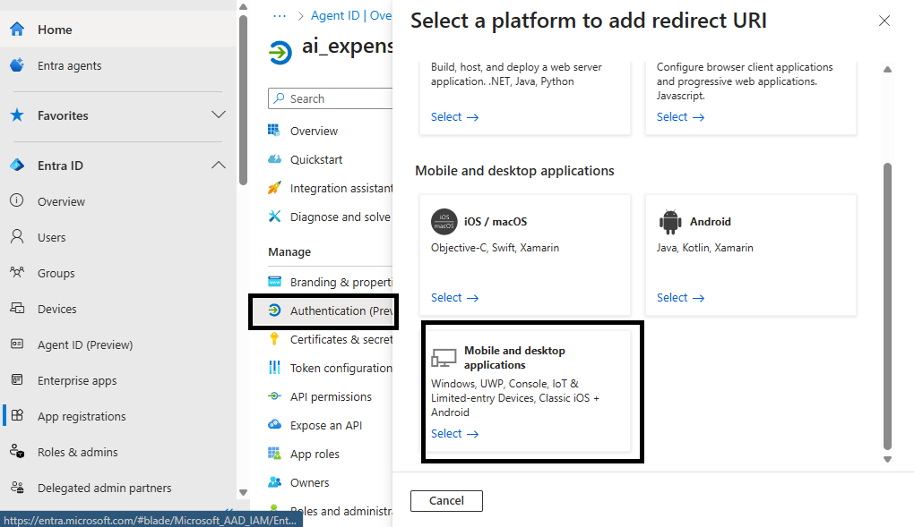
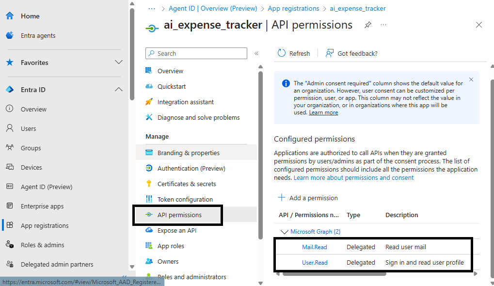

---
> **Note:** `query_expense.py` is a work in progress and its results may not be fully reliable. Use with discretion and verify outputs as needed.

# AI Expense Tracker


A modular pipeline for extracting, storing, and analyzing personal financial transactions using bank statement PDFs, MongoDB, and LLMs.

---

## Project Overview

This project enables you to:
- Parse bank statement PDFs into structured JSON transactions and insert them into MongoDB.
- Analyze expenses and answer natural language queries using LLMs and pandas.

---


## Workflow Sequence

1. **Download Bank Statement Attachments**
   - Use `saveMailAttachment.py` to connect to your email (via Microsoft Graph API) and download PDF bank statements from a configured sender to the `attachments/locked/` directory.

2. **Unlock Password-Protected PDFs**
   - Use `unlockPDF.py` to batch-unlock password-protected PDFs in `attachments/locked/` and save the unlocked files to `attachments/unlocked/`. Passwords and directories are managed via `.env`.

3. **Orchestrate Data Extraction**
   - Use `pdfDataOrchestrator.py` to parse all unlocked PDF bank statements, extract metadata, categorize transactions, and insert them directly into MongoDB. No intermediate files are written to `processed_transactions/`.

4. **Query and Analyze Expenses**
   - Use `query_expense.py` to ask natural language questions about your expenses. The script uses an LLM to translate your query to MongoDB, fetches results, and summarizes with pandas and LLM.

---


## File Descriptions

| File                        | Purpose                                                                                 |
|-----------------------------|-----------------------------------------------------------------------------------------|
| `saveMailAttachment.py`     | Downloads PDF bank statement attachments from your email inbox to `attachments/locked/` using Microsoft Graph API. |
| `unlockPDF.py`              | Unlocks password-protected PDFs in `attachments/locked/` and saves them to `attachments/unlocked/`. Passwords and directories are set in `.env`. |
| `pdfDataOrchestrator.py`    | Extracts transactions from unlocked PDF statements and inserts them into MongoDB. |
| `query_expense.py`          | Translates natural language queries to MongoDB, fetches and analyzes expenses, summarizes with pandas and LLM. |
| `requirements.txt`          | Python dependencies for the project.                                                    |

---

## Setup Instructions

1. **Install Python dependencies**
   ```bash
   pip install -r requirements.txt
   ```


2. **Prepare your data**
   - Use `saveMailAttachment.py` to download PDF statements from your email to `attachments/locked/`.
   - Use `unlockPDF.py` to unlock password-protected PDFs and save them to `attachments/unlocked/`.
   - Create a `.env` file in the project root and fill in the required values (see below).

3. **Run the data orchestrator**
   ```bash
   python pdfDataOrchestrator.py
   ```
   - This will parse unlocked PDFs in `attachments/unlocked/` and insert transactions directly into MongoDB.

4. **Query your expenses**
   ```bash
   python query_expense.py
   ```
   - Ask questions like "What did I spend on groceries last month?"
   - The script will:
     - Use LLM to translate your query to a MongoDB query
     - Fetch results from MongoDB
     - Summarize results using pandas and LLM

---


## Notes

- All data flows through a modular pipeline: email download → PDF unlock → data extraction → MongoDB → LLM-powered analysis.
- All configuration (paths, passwords, connection strings) is managed via `.env`.
- LLM analysis requires [Ollama](https://ollama.com/) and a supported model (e.g., llama3).
- MongoDB is used for storing and querying transactions.

---


## Example Usage

1. **Download attachments from email:**
   ```bash
   python saveMailAttachment.py
   ```
   - Downloads PDF statements to `attachments/locked/`.

2. **Unlock password-protected PDFs:**
   ```bash
   python unlockPDF.py
   ```
   - Unlocks PDFs and saves them to `attachments/unlocked/`.

3. **Extract data and insert into MongoDB:**
   ```bash
   python pdfDataOrchestrator.py
   ```
   - Parses unlocked PDFs and inserts transactions into MongoDB.

4. **Analyze expenses:**
   ```bash
   python query_expense.py
   ```
   - Enter natural language queries, get results from MongoDB, summarized with pandas and LLM.

---


## Script Highlights

### saveMailAttachment.py
- Downloads PDF bank statement attachments from your email inbox using Microsoft Graph API.
- Configurable sender email, client ID, and other secrets via `.env`.
- Saves all attachments to `attachments/locked/`.

### unlockPDF.py
- Unlocks password-protected PDFs in `attachments/locked/` using a list of passwords from `.env`.
- Saves unlocked PDFs to `attachments/unlocked/`.
- All directory paths and passwords are managed via `.env`.

### pdfDataOrchestrator.py
- Reads all unlocked PDF statements from the configured directory.
- Extracts transaction rows, cleans and parses dates, amounts, and descriptions.
- Categorizes transactions (grocery, food delivery, rent, etc.) using keyword lists from `.env`.
- Detects payment method (UPI, NEFT, ATM, etc.) and extracts bank details.
- Inserts all parsed transactions into MongoDB for persistent storage and querying.

### query_expense.py
- Accepts natural language queries (e.g., "Total grocery spend in April 2025").
- Uses LLM to translate user queries into valid MongoDB queries.
- Fetches matching transactions or aggregates from MongoDB.
- Summarizes results using pandas and LLM.

---

## query_expense.py - Key Features

- Accepts natural language queries (e.g., "Total grocery spend in April 2025")
- Uses LLM to translate user queries into valid MongoDB queries
- Fetches matching transactions or aggregates from MongoDB
- Summarizes results using pandas (totals, averages, trends, category breakdowns)
- Uses LLM to generate human-friendly answers and insights
- Supports advanced analysis: monthly/quarterly/yearly summaries, category trends, merchant analysis

---


## Microsoft Entra Setup for Email Download

To use `saveMailAttachment.py`, you must register a new app in Microsoft Entra:

1. Go to [Microsoft Entra](https://entra.microsoft.com/).
2. Register a new app.  
   
3. While adding a redirect URI, select **Mobile and desktop applications** as the platform.  
   
   - Add `http://localhost` as the redirect URI.
4. In API permissions, add `Mail.Read` (required) and `User.Read` (optional).  
   
5. Use the generated client ID and authority in your `.env` file for `saveMailAttachment.py`.

## Environment Variable: ENV

The `.env` file can include an `ENV` variable to control which MongoDB collection is used for storing transactions:

- If `ENV=dev`, all transactions are stored in the `transactions_dev` collection (for development and debugging purposes).
- If `ENV` is not set to `dev`, transactions are stored in the main `transactions` collection (for production use).

This helps keep test and production data separate.

## .env Example (add to project root)

```
# Email and PDF download (used by saveMailAttachment.py)
CLIENT_ID=
AUTHORITY=
SCOPES=Mail.Read,User.Read
SENDER_EMAIL=
DOWNLOAD_DIR=attachments/locked
CACHE_FILE=token_cache.bin

# PDF unlock (used by unlockPDF.py)
INPUT_DIR=attachments/locked
OUTPUT_DIR=attachments/unlocked
PDF_PASSWORDS=pass1,pass2

# PDF and JSON paths for orchestrator (used by pdfDataOrchestrator.py)
INPUT_PDF_DIR=attachments/unlocked
OUTPUT_JSON_DIR=processed_transactions
COMBINED_FILE=all_transactions.json
DATE_FORMAT=%d-%m-%Y

# Transaction categorization lists (comma-separated)
CARRIER_LIST=
FOOD_DELIVERY=
SHOPPING=
TRANSPORT=
GROCERY=
HEALTHCARE=
RESTAURANTS=
FRUITS_VEGETABLES_FISH=
INTEREST_INCOME=
RENT=
EMI_LIST=
CREDIT_CARD_PAYMENT=
SUBSCRIPTION_SERVICES=
UTILITY_BILLS=
RECURRING_PAYMENTS=
FOODS_DRINKS=
ENTERTAINMENT=
PERSONAL_TYPE=
EDUCATION=
SPECIAL_EMI=

# MongoDB connection and environment
MONGODB_URI=
DB_NAME=
COLLECTION_NAME=
ENV=

# NOTE: Use the exact variable names shown above (e.g., MONGODB_URI and SPECIAL_EMI) so the scripts can read them correctly.
```

---

## License

MIT License (add your license here if needed)
